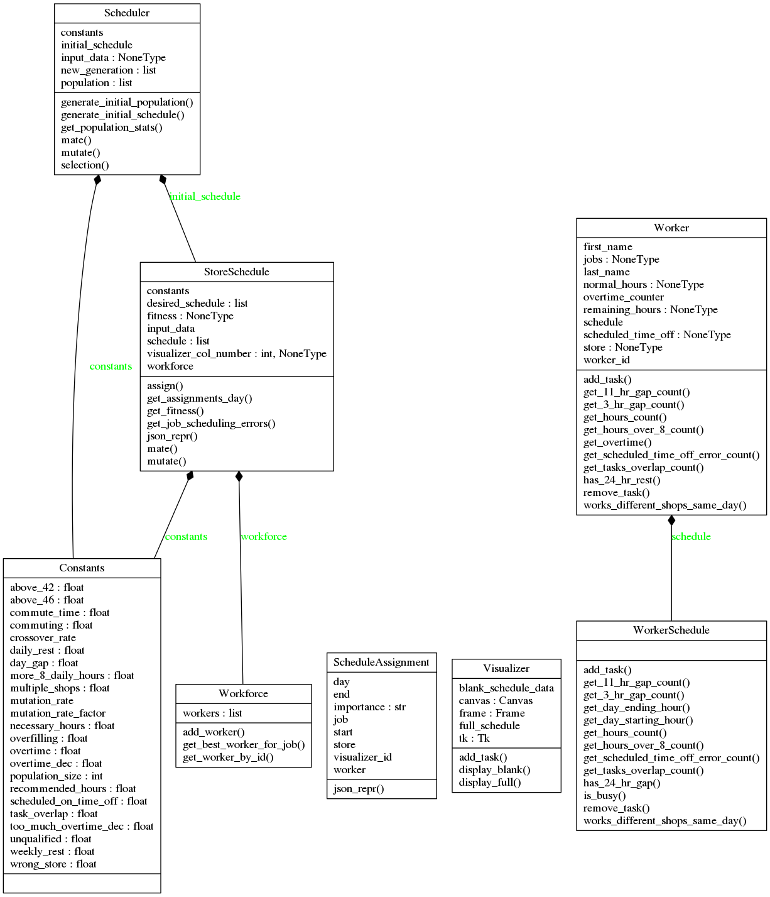
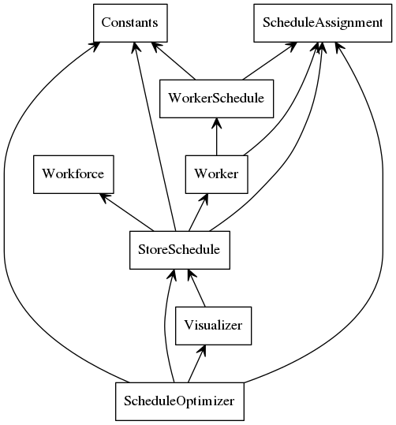

# Analyse IA pour de la planification

## Introduction

Ce document fait l'analyse du code produit pour la réalisation d'une "intelligence artificielle" (IA) permettant la création de planning pour l'ensemble des employés d'une boulangerie.

Cette IA ne répond pas aux besoins car elle n'est pas capable de fournir un résultat satisfaisant.

L'objectif de ce document est d'aider un développeur à comprendre l'état actuel du projet pour pouvoir l'améliorer, résoudre les problèmes ou reprendre depuis le début. Les problèmes, des améliorations possibles et des alternatives sont décrits dans ce document.

## Description du problème

La planification des personnes est un problème combinatoire de satisfaction de contraintes. C'est-à-dire que l'on cherche la meilleure combinaison dans un ensemble discret qui respecte les contraintes.

C'est un problème de complexité factorielle qui nécessite l'utilisation d'une heuristique pour approcher une solution optimale.

Les variables sont les différents créneaux à remplir, le domaine de définition de ces variables est l'ensemble des travailleurs. Les contraintes sont les suivantes :

* les compétences des travailleurs
* le code du travail (le temps de travail, le nombre d'heures consécutives maximum, le temps de pause...)
* jours de congé
* arrêt maladie
* ...

## Analyse de l'existant

### Fonctionnement général

Le site internet envoie le planning de la semaine pour une seule boulangerie avec la liste des employés ; et le but de l'IA est d'associer des personnes aux heures planifiées. L'utilisateur du site a la possibilité d'ajouter des heures supplémentaires aux employés manuellement puis d'utiliser l'IA. En cas d'urgence, d'arrêt maladie... le client devra sélectionner lui-même les collaborateurs et les heures en plus dont il a besoin.

Quand l'utilisateur clique sur le bouton IA sur le site web, un script python est exécuté. L'IA doit pouvoir générer le planning d'une boulangerie à la fois uniquement, et pour une semaine complète (lundi au dimanche).

Un fichier JSON est envoyé par le site web et est utilisé comme entrée par l'IA. Ce fichier contient :

* la liste d'exigence par jour
* la liste de workers
  * un id
  * nombre d'heures semaine normale
  * nombre d'heures qui reste
  * compétences
  * liste de jours et d'heures indisponibles

Exemple :

    {
        "schedule": {
            "mon": [
                [job, start, end, store, importance]
            ],
        }

        "worker": [
            {first name, last name, normal hours, hours left, jobs, store, rest}
        ]
    }

En sortie, l'algorithme retourne un fichier json avec un planning rempli et des "warnings" indiquant les différents problèmes et non respect des contraintes.

Exemple :

    {
        "assignments":[
            {
                "worker_id":1,
                "StartTime":7,
                "EndTime":12,
                "WeekDay":"wed",
                "JobName":"1"
            },
            {
                "worker_id":1,
                "StartTime":7.75,
                "EndTime":10.5,
                "WeekDay":"fri",
                "JobName":"1"
            },
          ]
    }

### Algorithme génétique

#### principe

L'algorithme utilisé est un algorithme génétique. Le principe est le suivant :

Une population d'individus initiale est créée. Chaque individu de la population est évalué grâce à une fonction de "fitness". Les individus ayant obtenu les meilleurs scores (les mieux adaptés) sont conservés pour créer la population suivante. Cette nouvelle population est créée en partie grâce à cette sélection, mais également par des croisements (crossover), les chromosomes des individus sont divisés et mélangés pour former de nouveaux individus. Pour apporter de la diversité génétique des mutations aléatoires sont effectuées. Ces opérations sont répétés sur plusieurs générations, jusqu'à ce qu'une des conditions suivantes soit respectée :

* le score converge vers une limite
* le nombre de générations maximum est dépassé
* l'objectif est rempli

Un algorithme génétique ne semble pas être une mauvaise idée pour résoudre ce problème. Cependant, il ne prend pas en compte certaines hypothèses que l'on pourrait faire pour simplifier le programme.

#### Organisation

Les fichiers sont :

* **config.txt** : un fichier texte contenant des paramètres
* **Constants.py** : une classe qui parse config.txt
* **ScheduleAssignment** : une tâche à faire dans le schedule
* **ScheduleOptimizer** : implémente l'algorithme génétique
* **StoreSchedule** : ce que l'on essaie d'optimiser (1 week = 1 individual of the pop = 1 chromosome)
* **Visualizer** : un visualiseur fait rapidement pour visualiser les plannings
* **Worker** : classe permettant de définir des workers
* **WorkerSchedule** : planning d'un worker
* **Workforce** : liste des "workers"

Diagramme de classes :

Interactions entre les packages :

### Implémentation

La logique de l'algorithme est étrangement séparée dans les classes `Scheduler`, `StoreSchedule` et `Workforce`.

`ScheduleOptimizer.py` est le point d'entrée du programme, il commence par charger les données du fichier JSON et le passe à un objet `Scheduler`. Cette classe sert de couche d'abstraction pour le contrôle de l'algorithme. `Scheduler.generate_initial_schedule` génère un planning arbitraire qui remplit le planning désiré sans respecter les contraintes des travailleurs. La population initiale est créée dans `Scheduler.generate_initial_population`.

Ici un individu représente un planning et est implémenté sous forme d'un objet `StoreSchedule` dont l'attribut principal est une liste d'affectation (`ScheduleAssignment`).

Pour prédire la progression de l'algorithme, une régression linéaire est effectuée sur plusieurs générations, si une tendance à la baisse est détectée l'exécution s'arrête sinon elle continue pour un nombre donné de générations.

#### Les mutations

Les mutations transforment les affectations de 6 façons différentes :

* `Extend` : ajoute 15 minutes à une assignation, si deux assignations sont en
conflits, la mutante est prioritaire
* `Reduce` : diminue de 15 minutes
* `Split` : sépare une assignation en deux moitiés égales
* `Merge` : fusionne 2 assignations touchantes
* `Swap` : échange les "workers" de 2 assignations
* `Change` : change le "worker" d'une assignation

Ces mutations produisent des résultats indésirés. En effet, la stratégie utilisée produit des horaires incomplètes et fragmentées. (Ex : de 6.14 à 6.29 puis 7.2 à 8.35)

### Problèmes

L'algorithme utilisé et les décisions prises ne permettent pas de résoudre le problème. Les mutations créent des horaires partielles. Les affectations sont inégales (une personne aura 60h alors que les autres 0). L'importance des compétences n'est pas respectée.

### Amélioration

Le code n'étant pas très lisible, ni bien organiser, je conseillerais de recommencer entièrement. Cependant des améliorations semblent envisageables. J'essaie ici de lister un maximum de pistes qui permettraient d'améliorer le programme. Cette liste est ni ordonnée, ni exhaustive.

#### amélioration 1 : modifier les mutations

Les mutations introduisent un comportement indésirable, ajouter ou diminuer une affectation de 15 minutes ne semble pas être une bonne idée. Supprimer ce comportement en modifiant `StoreSchedule.mutate` devrait grandement augmenter la qualité du résultat.

#### amélioration 2 : modification de la fonction de fitness

L'un des composants les plus importants d'un algorithme génétique est sa fonction de fitness. Modifier `StoreSchedule.get_fitness` en réglant finement les paramètres pourraient aider.

#### amélioration 3 : optimiser une fonction lente

La méthode `StoreSchedule.get_job_scheduling_errors()` est la plus lente et l'optimiser permettrait d'augmenter les performances. Pour une raison que je ne connais pas, cette fonction découpe une journée (24h) en 288 blocs de 12 minutes.

#### amélioration 4 : fichier de configuration

Il serait plus convenable d'inscrire les différentes constantes et paramètres dans un fichier python plutôt que d'utiliser un fichier texte (config.txt) que le programme doit parser à chaque fois.

## Alternatives

L'algorithme utilisé ne fait aucune supposition qui pourrait aider à réaliser un planning.

Une hypothèse que l'on peut faire est que la force de travail est dimensionnée aux besoins. Ainsi, on pourrait trier les tâches par compétences et y associer les travailleurs qui les possèdent. Cela permettrait de découper le problème en plusieurs sous-instances et d'éviter d'affecter des personnes à des emplois dont ils ne possèdent pas les compétences.

Un algorithme glouton (greedy algorithm) avec les bonnes hypothèses semble pouvoir être suffisant pour résoudre le problème.

Pour améliorer les performances, en choisissant les bonnes représentations d'autres algorithmes de recherches (branch and bound, beam search, A*) peuvent être utilisés pour résoudre le problème.
